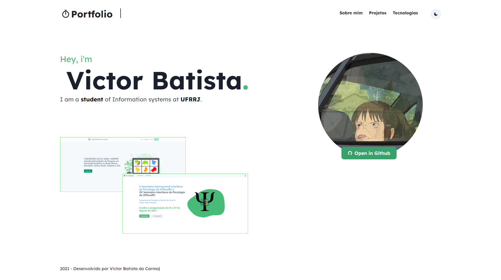

# Personal Portfolio



[](https://forthebadge.com)

# To do
- [X] Navbar
- [X] Header
- [X] Hero
- [X] Footer
- [x] Projetos
- [x] Tecnologias
- [x] Responsividade


# Made with:
<p align="left"> 

<a href="https://reactjs.org/" target="_blank">  </a>
<a href="https://sass-lang.com" target="_blank">  </a> 
<a href="https://www.typescriptlang.org/" target="_blank">  </a>
<a href="https://www.figma.com/" target="_blank">  </a>
<a href="https://git-scm.com/" target="_blank">  </a> 
</p>

## Run the development server:

```bash
npm run dev
# or
yarn dev
```

Open [http://localhost:3000](http://localhost:3000) 

# Developing...😴
