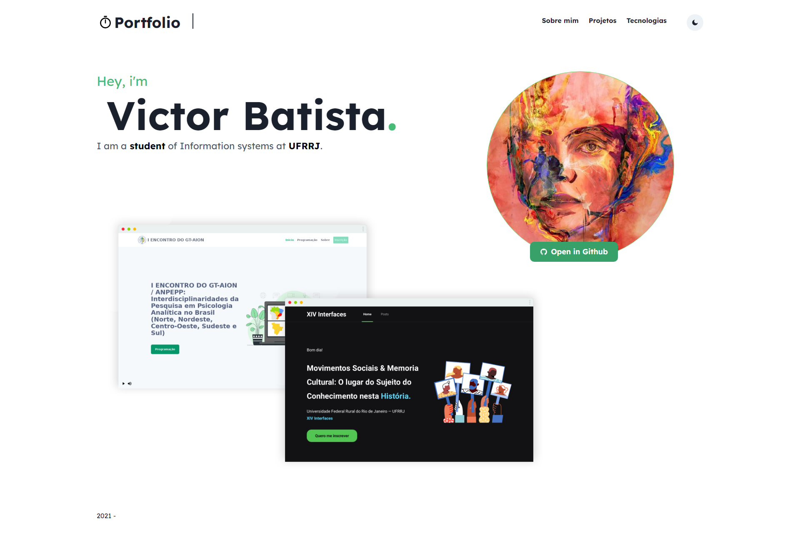

# Personal Portfolio



[](https://forthebadge.com)

Made with [**Chakra UI**](https://chakra-ui.com) and [**TypeScript**](https://www.typescriptlang.org) 

## Then, run the development server:

```bash
npm run dev
# or
yarn dev
```

Open [http://localhost:3000](http://localhost:3000) 
